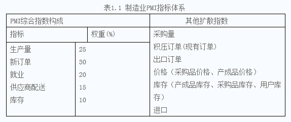

#PMI
---
PMI（Purchasing Managers' Index），采购经理指数，涵盖着生产与流通、制造业与非制造业等领域，是国际上通行的宏观经济监测指标体系之一，对国家经济活动的监测和预测具有重要作用。

PMI指数50为荣枯分水线，当PMI大于50时，说明经济在发展，当PMI小于50时，说明经济在衰退。

PMI是一套月度发布的、综合性的经济监测指标体系，分为`制造业PMI`、`服务业PMI`，也有一些国家建立了建筑业PMI。全球已有20多个国家建立了PMI体系，世界制造业和服务业PMI已经建立。

###调查方法
---
PMI每项指标均反映了商业活动的现实情况，综合指数则反映制造业或服务业的整体增长或衰退。

调查采用非定量的问卷形式，被调查者对每个问题只需做出定性的判断，在（比上月）上升、不变或下降三种答案中选择一种。进行综合汇总就是统计各类答案的百分比，通过各指标的动态变化来反映经济活动所处的周期状态。

制造业及非制造业PMI商业报告分别于每月第一个和第三个工作日发布，时间上大大超前于政府其他部门的统计报告，所选的指标又具有先导性，所以PMI已成为监测经济运行的及时、可靠的先行指标，得到政府、商界与广大经济学家、预测专家的普遍认同。

###制造业PMI
---
制造业PMI最早起源于美国二十世纪三十年代，经过几十年的发展，该体系现包含新订单、产量、雇员、供应商配送、库存、价格、积压订单、新出口订单、进口等商业活动指标。

###服务业PMI
---
服务业PMI指标体系则包括：商业活动、投入品价格指数、费用水平、雇员、未来商业活动预期等指数，但因其建立时间不长，尚未形成综合指数。
