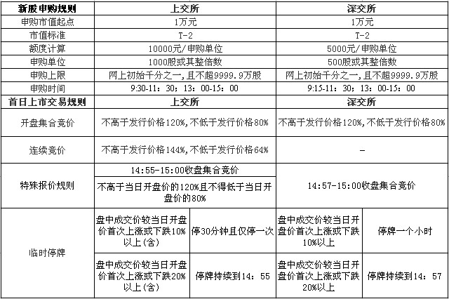

#新股申购规则
---
根据交易所有关规定，在新股认购中，投资者的申购款于T+4日返还其证券商资金帐户，也就是说，投资者可于申购新股后的第四个交易日使用该笔资金。

如果其间正好遇上星期六和星期日为例假日，要顺延一、二天才能解冻，如某股3月20日（星期五）开始认购，投资者资金需至3月26日才能使用。

###申购流程
---
1. 投资者申购（T日）：投资者在申购时间内缴足申购款，进行申购委托。
2. 资金冻结（T+1日）：由中国结算公司将申购资金冻结。
3. 验资及配号（T+2日）：交易所将根据最终的有效申购总量，按每1000（深圳500股）股配一个号的规则，由交易主机自动对有效申购进行统一连续配号。
4. 摇号抽签（T+3日）：公布中签率，并根据总配号量和中签率组织摇号抽签，于次日公布中签结果。
5. 资金解冻（T+4日）：对未中签部分的申购款予以解冻。

根据《关于股票上网发行资金申购的补充通知，网上申购新股时间将由此前的四个交易日缩短为三个交易日，但是必须经过发行人和主承销商申请并获得交易所同意才可适用。

根据补充通知，发行人及其主承销商可以向交易所申请将资金申购上网定价发行流程缩短一天。 而沪深交易所是将新股申购流程中资金冻结（T+1日）和验资及配号（T+2日）合并为资金冻结、验资及配号（T+1日），即将“T+1”和“T+2”两个交易日需要处理的事情，合并为一个交易日来操作的，这样新股申购资金解冻日就变为（T+3日），即申购日后的第三天（T+3日）公布中签结果，并按相关规定进行资金解冻和新股认购款划付。

###首日上市交易规则
---

